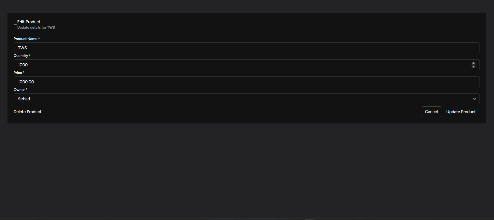

# DATABASE

memiliki 2 role yaitu :
1. admin
2. user

# WEB
## Jika menggunakan Admin

Button View

Button Edit

Button Add

Hasil ketika menambahkan data

Button Delete

Hasil ketika menghapus data

## Jika menggunakan User
tidak bisa menambahkan, menghapus, dan mengedit data

Button View
